```{=html}
<style>
body {
  background-color: white;
  color: black;
}

slides > slide {
  background: white;
  color: black;
  font-size: 32px;
  padding: 0em 0em !important;
}

/* Title slide vertical centering */
.title-slide {
  background: white;
  color: black;
  display: flex !important;
  align-items: center !important;
  justify-content: center !important;
  background-image: url("images/TAMU_logo.png");
  background-size: 13%;
  background-repeat: no-repeat;
  background-position: center bottom;
}

.title-slide hgroup {
  position: absolute;
  top: 50%;
  left: 50%;
  transform: translate(-50%, -50%);
  width: 100%;
}

.title-slide hgroup h1 {
  color: #500000;
  font-size: 80px;
  font-weight: 700;
  text-align: center;
  margin-bottom: 20px;
}

.title-slide hgroup h2 {
  color: black;
  font-size: 44px;
  font-weight: 300;
  text-align: center;
  margin-bottom: 13px;
}

.title-slide hgroup p {
  color: black;
  font-size: 28px;
  text-align: center;
}

/* heading sizes */
h2 {
  font-size: 42px;
  color: black;
}

h3 {
  font-size: 40px;
  color: black;
}

/* list item size */
li {
  font-size: 32px;
  color: black;
}

li li {
  font-size: 24px;
  color: black;
}

/* paragraph size */
p {
  font-size: 32px;
  color: black;
}

.emailmaroon {
  border:        3px solid #800000;
  background:    #ededed;
  padding:       .075em .075em .075em .075em;
  border-radius: 12px;
}

.emailblue {
  display: inline-block;
  width: auto;
  max-width: fit-content;
  border: 3px solid blue;
  background: #ededed;
  padding: 0.15em 0.45em;
  border-radius: 12px;
  white-space: nowrap;
}

.emailred {
  display: inline-block;
  width: auto;
  max-width: fit-content;
  border: 3px solid red;
  background: #ededed;
  padding: 0.15em 0.45em;
  border-radius: 12px;
  white-space: nowrap;
}

table { 
    margin-left: 0; /* Ensures no left margin */
    float: left; /* Helps in some rendering engines */
}

.bottom-image {
  position: absolute;
  bottom: 1em;
  left: 50%;
  transform: translateX(-50%);
  max-height: 40%;
  width: auto;
  opacity: 0.99;
  pointer-events: none;
}

.bottom-image2 {
  position: absolute;
  bottom: 1em;
  left: 50%;
  transform: translateX(-50%);
  max-height: 30%;
  width: auto;
  opacity: 0.99;
  pointer-events: none;
}

.slide-number {
  right: 3px !important;
  bottom: 3px !important;
}

</style>
```

```{r setup, include=FALSE}
knitr::opts_chunk$set(echo = FALSE)
```

## Agenda
<!-- # Capstone Senior Design – Data Engineering -->

1. Introduction
2. Goals and Expectations
3. Semester Overview: Milestones and Deliverables
4. Grading and Assessment
5. Code of Conduct: Importance and Development
6. V-Model Phases and Project Items
7. Configuration Items (CI) &rarr; Project Charter

<!-- ## Agenda -->
<!-- - Course -->
<!-- - Overview of the Semester -->
<!--   - Some details including <mark>grades</mark> -->
<!-- - Communication Team -->
<!-- - Code of Conduct: Importance and Development -->
<!-- - V-Model &rarr; Configuration Items (CI) -->
<!-- - CIs &rarr; Project Charter Adjustments -->

## Instructors

Course Instructors

## What is The Most Important Thing?

> - **In life**, the most important thing is [**subjective**]{style="color: red;"}.
> - [**Primary dimensions**]{style="color: red;"}:
    <div class="emailred">Health, Love & Relationships, Purpose & Meaning, Gratitude, Freedom, Learning & Growth, Self-Care.</div>
> - This [**set of dimensions**]{style="color: red;"} makes a conceptual [**backbone for our capstone**]{style="color: #800000;"}, because it positions the course not as a technical culminating experience, but as a **professional and personal transition course.**

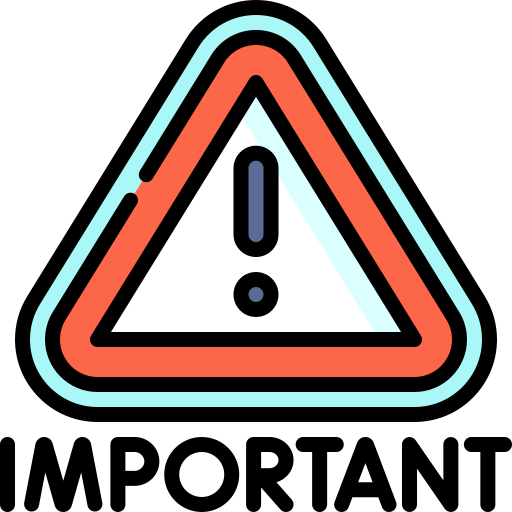

## [The Bridge Between Academic Training and Life (After Graduation)]{style="font-size: 32px;"}

- Learn to [**go beyond**]{style="color: red;"} working your team's project,\
  develop the ability to [**work in any project!**]{style="color: red;"}
- Others may always outpace you in [**technical expertise**]{style="color: red;"}.
- Your true advantage is [**systems thinking**]{style="color: #800000;"}, an advantage that reaches its full power when paired with **strong communication!**

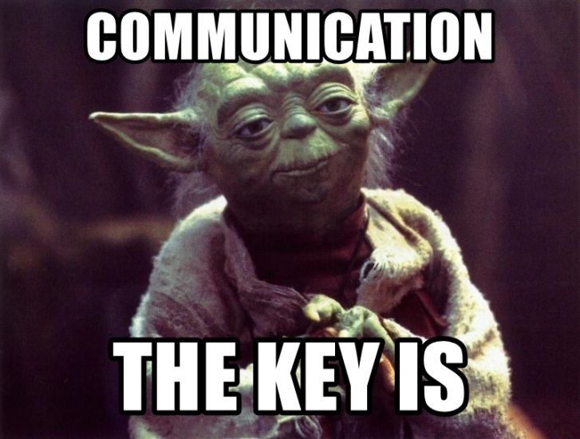

## Course

- [**Capstone Design**]{style="color: red;"} class represents the culmination of an educational journey.
- It's where [**theory**]{style="color: red;"} meets [**practice**]{style="color: red;"},\
  [**abstraction**]{style="color: red;"} meets [**reality**]{style="color: red;"},
  and the [**individual student**]{style="color: #800000;"} transitions from **learning concepts** to **creating, evaluating,
  and owning** a complete system.


## Goals

- **Apply** Data Engineering Knowledge
- **Develop** End-to-End Project Skills
  - **Plan**, **document**, **execute** projects using a structured framework (i.e., V-Model).
- Foster **Collaboration** & **Professional Skills**
- Strengthen **Problem-Solving** & **Critical Thinking**
- **Prepare** for Industry and Research
  - Build a portfolio demonstrating technical and teamwork skills,
  - Experience working under professional expectations.

## [ISEN Mission Statement]{style="color: #800000;"}

**To serve** [the state, nation and global community by educating industrial engineering students to be well founded in engineering fundamentals and]{style="color: #C0C0C0;"} **to have the knowledge and skills** [required]{style="color: #C0C0C0;"} [**to design, develop, improve, implement and control**]{style="color: green;"} [sophisticated production and service]{style="color: #C0C0C0;"} **systems** [in an environment characterized by]{style="color: #C0C0C0;"} **complex technical and social challenges**. [Throughout this educational process, students will be instilled with the]{style="color: #C0C0C0;"} **highest standards of professional and ethical behavior**.


## Expectations

- Active Participation
- Ownership and Accountability
- Professional Communication
- Quality and Documentation
- Ethical Conduct

## Professional Standards of Conduct

Professional Standards of Conduct

## Attendance

Attendance

## Confidentiality and Non-attribution

Confidentiality and Non-attribution

## Faculty Advisor

Faculty Advisor

## Sponsors

Sponsors

## Milestones

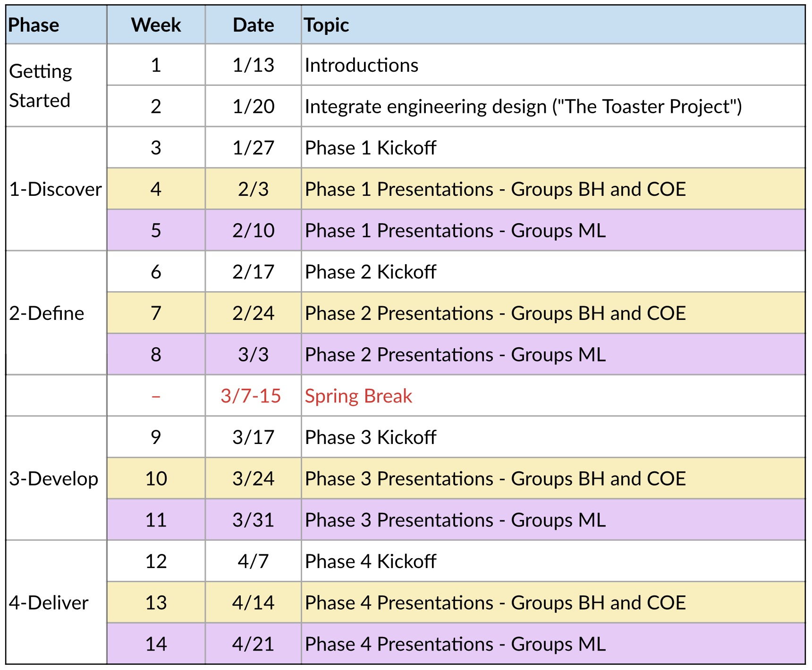

## Deliverables

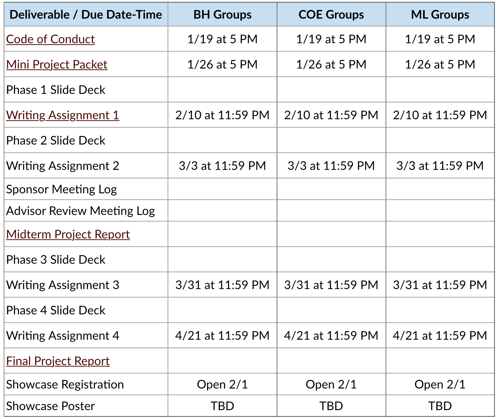

## Grading and Assessment

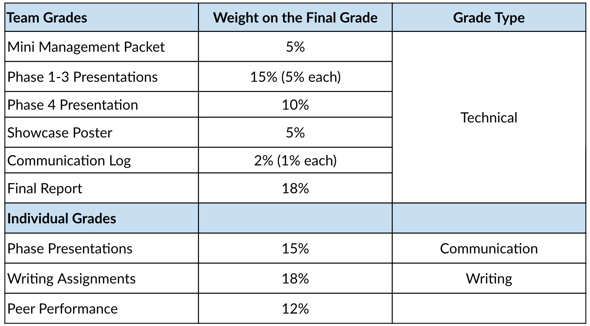

## Team Work?

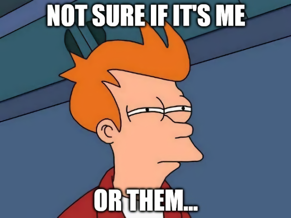

## Team Work

- In industry, project failure is rarely caused by lack of technical skill.
  Most often caused by:
  - Unclear expectations,
  - Poor communication,
  - Uneven workload distribution,
  - Missed deadlines,
  - Unresolved conflict,
  - Unprofessional behavior.

## Social Loafing

Social Loafing

## Code of Conduct

- Let us prevent these problems before they occur.
- Due 1/19 at 5 PM
- On Canvas:
  <span style="font-size: 24px;">https://canvas.tamu.edu/courses/431435/assignments/2874310</span>

## V-Model

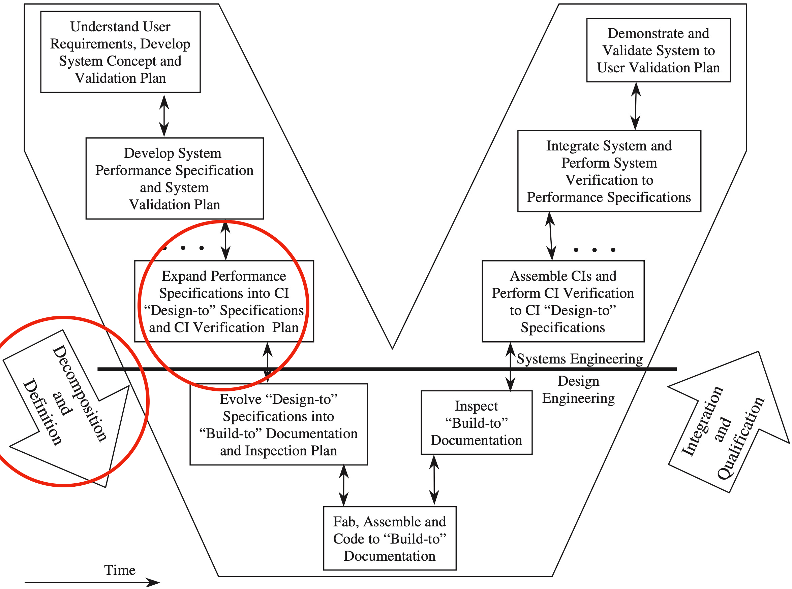

## What is a Configuration Item (CI)?

- A CI is any [**hardware, software, firmware, document, or combination**]{style="color: red;"} thereof that is:
  - Individually identifiable,
  - Formally baselined,
  - Controlled under configuration management,
  - Verified against approved specifications.
- In other words, a CI is anything the organization has decided must be [**controlled, versioned, and verified**]{style="color: #800000;"} as its own official product element.

## What is a Configuration Item (CI)?

- In data engineering, a CI is:
  <div class="emailred">Any [**version-controlled,\
                             independently testable,\
                             production-quality component**]{style="color: red;"}\
                             of a data system that has formal requirements,\
                             formal tests, and formal approval.</div>
- A CI is no longer "just a file", it becomes a [**certified system component**]{style="color: #800000;"}.

## <span style="font-size: .9em;">What Counts as a CI in a Data Platform</span>

<table style="width:85%; margin:12px auto;">
<thead style="background-color:#f0f0f0;">
<tr>
<th style="color:#500000; font-size:32px; font-weight:bold; padding:4px 4px; border-bottom:3px solid #500000; text-align:left;">CI Area</th>
<th style="color:#500000; font-size:32px; font-weight:bold; padding:4px 4px; border-bottom:3px solid #500000; text-align:left;">Examples</th>
</tr>
</thead>
<tbody>
<tr><td style="font-size:28px; padding:3px 4px;">Sources</td>
<td style="font-size:28px; padding:3px 4px;">Ingest schema, API feed</td></tr>
<tr><td style="font-size:28px; padding:3px 4px;">Pipelines</td>
<td style="font-size:28px; padding:3px 4px;">ETL job, stream proc</td></tr>
<tr><td style="font-size:28px; padding:3px 4px;">Storage</td>
<td style="font-size:28px; padding:3px 4px;">Warehouse schema, lakehouse</td></tr>
<tr><td style="font-size:28px; padding:3px 4px;">Code</td>
<td style="font-size:28px; padding:3px 4px;">Feature lib, validation</td></tr>
<tr><td style="font-size:28px; padding:3px 4px;">Models</td>
<td style="font-size:28px; padding:3px 4px;">Forecast, classifier</td></tr>
<tr><td style="font-size:28px; padding:3px 4px;">Orchestration</td>
<td style="font-size:28px; padding:3px 4px;">Airflow DAG, dbt</td></tr>
<tr><td style="font-size:28px; padding:3px 4px;">Interfaces</td>
<td style="font-size:28px; padding:3px 4px;">API, data contracts</td></tr>
<tr><td style="font-size:28px; padding:3px 4px;">Governance</td>
<td style="font-size:28px; padding:3px 4px;">Quality rules, PII mask</td></tr>
<tr><td style="font-size:28px; padding:3px 4px;">Docs</td>
<td style="font-size:28px; padding:3px 4px;">Data dict, lineage</td></tr>
</tbody>
</table>

## Project Charter Adjustments

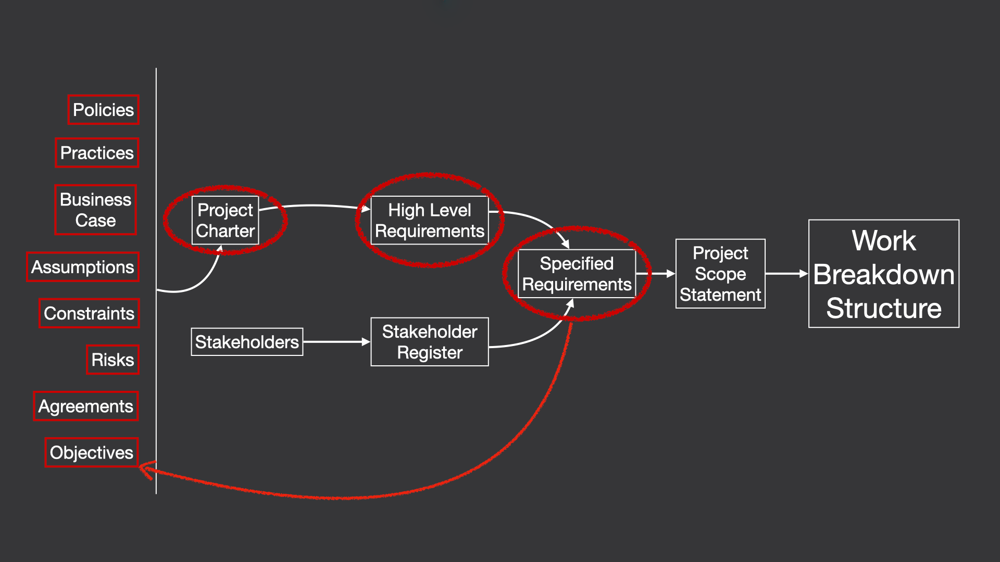

## Mini Project Packet

## Purpose

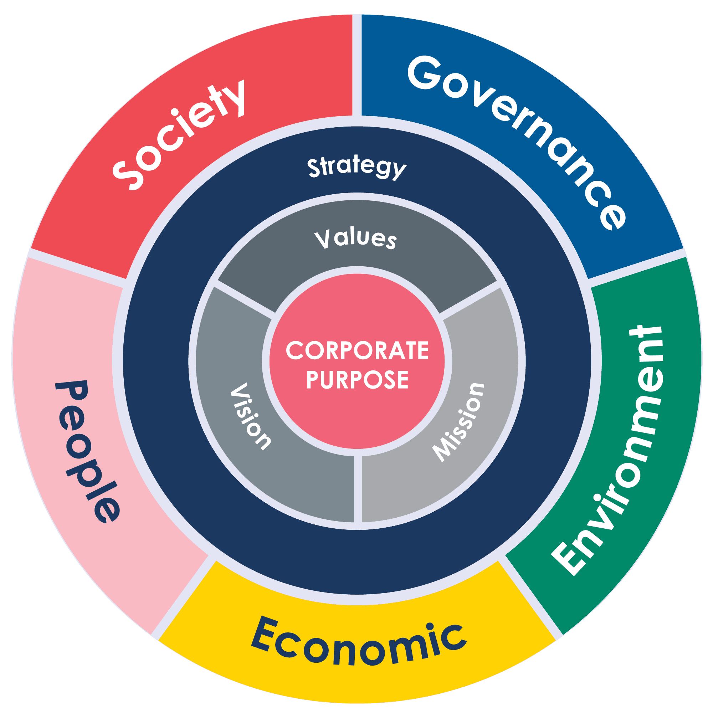

## SE and PM Integration

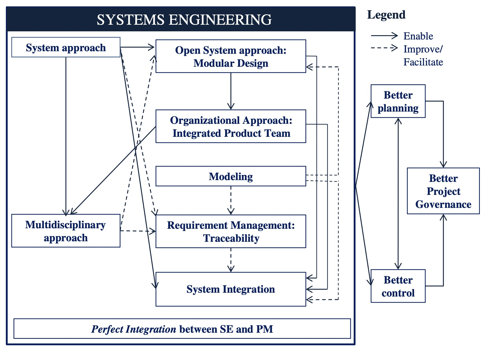

## Gantt Chart

Gantt Chart

## SE Standards

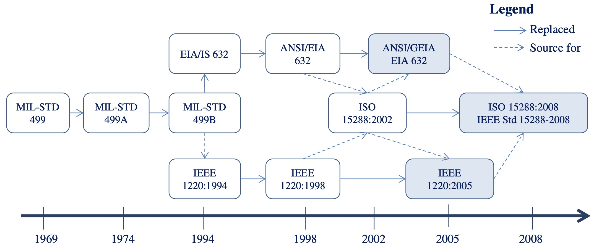

<!-- ## Slide with R Output -->

<!-- ```{r cars, echo = TRUE} -->

<!-- summary(cars) -->

<!-- ``` -->

<!-- ## Slide with Plot -->

<!-- ```{r pressure} -->

<!-- plot(pressure) -->

<!-- ``` -->

<!-- remotes::install_github("yihui/xaringan") -->
