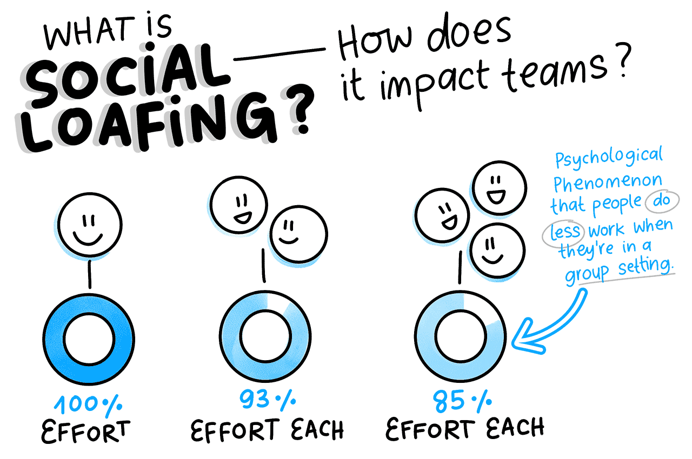
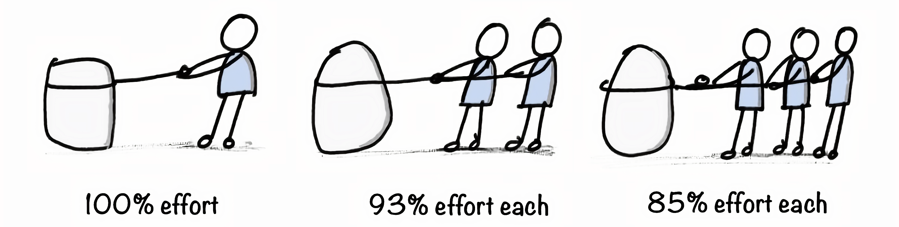

```{r setup, include=FALSE}
knitr::opts_chunk$set(warning = FALSE, message = FALSE, 
                      fig.retina = 3, fig.align = "center")
```

class: center middle main-title section-title-4

# Introductions

.class-info[
<span style="font-size: 64pt;">🎓</span>

DAEN 640 Capstone Senior Design

.light[
Alexander Abuabara<br>
Jan 2026]
]

---

name: outline
class: title title-inv-1

# Plan for today

--

.box-2.medium[Introductions]

--

.box-3.medium[Goals & Expectations]

--

.box-4.medium[Semester Overview]

--

.box-5.medium[Grading & Assessment]

--

.box-6.medium[Code of Conduct]

---

layout: false
class: center middle section-title section-title-2 animated fadeIn
<!-- name: slides -->

# Instructors

---

layout: false

.pull-left-3.center[
.box-inv-2[Alexander<br>Abuabara]
<figure>

</figure>
]

--

.pull-middle-3[
.box-inv-2[Jose<br>Vazquez]
<figure>

</figure>
]

--

.pull-right-3[
.box-inv-2[Jon<br>Elizondo]
<figure>

</figure>
]

---

layout: false
name: slides
class: center middle section-title section-title-3 animated fadeIn

# Goals and Expectations

---

layout: true
class: title title-3

---

# What is The Most Important Thing?

.box-inv-3.sp-after[*In life*, the most important thing is subjective]

--

.box-3.sp-after[
Health, Love & Relationships, Purpose & Meaning,<br>
Gratitude, Freedom, Learning & Growth, Self-Care
]

--

.box-inv-3.SMALL.sp-after[
These dimensions makes a conceptual backbone for our capstone,<br>
framing it not as a purely <span style="color: red;">technical</span> culmination experience,<br>
but as a 
<span class="highlight">
professional & personal transition course
</span>
]

---

layout: false

.box-3.sp-after-short[
The Bridge Between Academic Training & Life<br>
(After Graduation)
]

--

.box-inv-3.SMALL.sp-after-short[
Comprehensive <span class="highlight">technical expertise!</span>
]

--

.box-3.sp-after-short[
Learn to <span class="highlight-red">go beyond</span> working your team's project,<br>
develop the ability to work in any project!
]

--

.box-inv-3.SMALL.sp-after-short[
Success is fully achieved when combined with<br>
<span class="highlight">
strong communication!
</span>
]

---

layout: false

---

&nbsp;

.center[
<figure>

</figure>
]

---

&nbsp;

.box-3.SMALL.sp-after[
Capstone Design represents the culmination of an educational journey
]

--

.box-inv-3.sp-after[
It's where **theory** meets **practice**, **abstraction** meets **reality**
]

--

.box-3.sp-after[
The individual student transitions from learning concepts 
to creating, evaluating, and owning a complete system
]

---

class: bg-full
background-image: url("images/life-journey.gif")

---

layout: true
class: title title-inv-6

---

# Goals

.box-6.sp-after-veryshort[Apply data engineering knowledge]
--
.box-inv-6.sp-after-veryshort[Develop end-to-end project skills]
--
.box-6.SMALL.sp-after-veryshort[Plan, document, execute projects using a structured framework (<span style="color: yellow;">V-Model</span>)]
--
.box-inv-6.sp-after-veryshort[Foster collaboration & professional skills]
--
.box-6.SMALL.sp-after-veryshort[Build a portfolio demonstrating technical & teamwork skills]
--
.box-inv-6.sp-after-veryshort[Prepare for industry & research]
--
.box-6.sp-after-veryshort[Strengthen problem-solving & critical thinking]
--
.box-inv-6.sp-after-veryshort[Experience working under professional expectations]

---

#  Expectations

.box-6.sp-after-short[Active Participation]
--
.box-inv-6.sp-after-short[Ownership & Accountability]
--
.box-6.sp-after-short[Professional Communication]
--
.box-inv-6.sp-after-short[Quality & Documentation]
--
.box-6.sp-after-short[Ethical Conduct]

---

layout: true
class:

---

# <span style="color: maroon;"> ISEN Mission Statement </span>

>  <span style="color: red; font-size: 30pt;">
   **To serve**
   </span>
   <span style="color: #C0C0C0; font-size: 27pt;">
   the state, nation and global community by educating 
   industrial engineering students to be well founded in engineering 
   fundamentals and
   </span>
   <span style="color: red; font-size: 30pt;">
   **to have the knowledge and skills**
   </span>
   <span style="color: #C0C0C0; font-size: 27pt;">
   required<br>
   </span>
   <span style="color: green; font-size: 30pt;">
   **to design, develop, improve, implement and control**
   </span>
   <span style="color: #C0C0C0; font-size: 27pt;">
   sophisticated production and service
   </span>
   <span style="color: red; font-size: 30pt;">
   **systems**
   </span>
   <span style="color: #C0C0C0; font-size: 27pt;">
   in an environment characterized by
   </span>
   <span style="color: red; font-size: 30pt;">
   **complex technical and social challenges**
   </span>
   <span style="color: #C0C0C0; font-size: 27pt;">
   . Throughout this educational process, students will be instilled with the
   <span style="color: maroon; font-size: 30pt;">
   **highest standards of professional and ethical behavior**.
   </span>

.center[
<figure>

</figure>
]

---

layout: false
class: center middle section-title section-title-4 animated fadeIn

# Semester Overview

---

layout: true

---

# Weekly Schedule

| Week | Date | Topic |
|------|------|-------|
| 1    | 1/13 | Introductions + Comm Requirements |
| 2    | 1/20 | Integrate Engineering Design (*The Toaster Project*) |

---

# Weekly Schedule

| Week | Date | Topic |
|:-----|:----:|-------|
| 3    | 1/27 | Phase 1 Kickoff |
| 4    | 2/3  | Phase 1 Presentations - Groups BH & COE |
| 5    | 2/10 | Phase 1 Presentations - Groups ML |
|      |      |       |
| 6    | 2/17 | Phase 2 Kickoff |
| 7    | 2/24 | Phase 2 Presentations - Groups BH & COE |
| 8    | 3/3  | Phase 2 Presentations - Groups ML |

---

.box-4.normal.sp-after-short[
March 7-15
]

.center[
<figure>

</figure>
]

---

# Weekly Schedule

| Week | Date | Topic |
|:-----|:----:|-------|
| 9    | 3/17 | Phase 3 Kickoff |
| 10   | 3/24 | Phase 3 Presentations - Groups BH & COE |
| 11   | 3/31 | Phase 3 Presentations - Groups ML |
|      |      |   |
| 12   | 4/7  | Phase 4 Kickoff |
| 13   | 4/14 | Phase 4 Presentations - Groups BH & COE |
| 14   | 4/21 | Phase 4 Presentations - Groups ML |

---

layout: true
class: title title-4

---

# Attendance

* Mandatory attendance for everyone:

  * First two weeks of class
  * Phase kick-offs

--

* Team presentation days:

  * All team members must stay for the entire class!
  * Other students are welcome & encouraged to attend

---

# Faculty Advisor

* Each team must select a Texas A&M faculty advisor.

--

* Advisors are chosen for their expertise or interest in the project topic.

--

* Instructors may assist in identifying advisors if needed.

---

# Faculty Advisor

* Advisors serve as the team's subject matter expert, providing guidance & recommendations.

--

* Biweekly meetings are recommended, based on advisor availability.

--

* Advisors take an active advisory role but are not responsible for developing solutions.

--

* Teams must treat advisors with professional respect & courtesy.

---

# Sponsors

* The project sponsor is the **client**, owner of the project problem or opportunity.

--

* Each team must assign a *Point of Contact* to manage sponsor communication.

--

* Communication frequency & format should be defined based on sponsor availability.

--

* Regular **face-to-face** meetings (in person or video) are required; email alone is insufficient!

---

# Sponsors

* **ALL** team members should attend sponsor meetings; absences must be acknowledged with reasons.

--

* Meetings are scheduled by the POC and sponsor and must start and end on time with <u>an agenda</u>.

--

* Only the sponsor may cancel meetings; cancellations must be reported in technical presentations.

--

* If meeting frequency is unacceptable to the sponsor, document it and consult the primary instructor.

---

# Confidentiality & Non-attribution

* Course data, client info, and project discussions are confidential

  * Share information only with classmates or instructors, following confidentiality rules

--

* Keep confidential materials secure

  * In a folder, binder, or password-protected device

  * On your person or in a safe location (room, backpack, car)

---

# Confidentiality & Non-attribution

* Don’t attribute information to specific people or teams

  * Use phrases like: "It’s my understanding that…"

--

* Treat NDAs seriously!

.center[
<figure>

</figure>
]

---

layout: false
name: slides
class: center middle section-title section-title-5 animated fadeIn

# Grading & Assessment

---

layout: false

<!-- # Grading -->

.small[
| Team Grades | Weight on the Final Grade | Grade Type |
|:------------|:-------------------------:|:----------:|
| Mini Management Packet  | 5%            | Technical |
| Phase 1-3 Presentations | 15% (5% each) | " |
| Phase 4 Presentation    | 10%           | " |
| Showcase Poster         | 5%            | " |
| Communication Log       | 2% (1% each)  | " |
| Final Report            | 18%           | " |
| **Individual Grades**   |               |   |
| Phase Presentations     | 15%           | Communication |
| Writing Assignments     | 18%           | Writing |
| Peer Performance        | 12%           | &nbsp;  |
]

<!-- --- -->

<!-- # Deliverables -->

---

layout: true
class: title title-5

---

# Deliverables

* <span style="color: gray; font-size: 22pt;">We’ll try to stick to the schedule, but some changes may happen to help you learn better</span>

* <span style="color: gray; font-size: 22pt;">Check Canvas for all official due dates</span>

--

  * <span style="color: gray; font-size: 22pt;">They’re final unless we send a notice by Canvas + email</span>

--

* <span style="color: gray; font-size: 22pt;">You can resubmit assignments for a better grade after the due date</span>

* <span style="color: gray; font-size: 22pt;">All regrade work must be in by the assignment’s close date</span>

--

* <span style="color: gray; font-size: 22pt;">When resubmitting, make sure to:</span>
  * <span style="color: gray; font-size: 22pt;"><span class="highlight">Highlight</span> what you changed</span>
  * <span style="color: gray; font-size: 22pt;">Address ALL feedback from class, presentations, or office hours</span>

---

# Use AI responsibly and within limits

* Brainstorm ideas
* Check your work for grammar, spelling, clarity, and brevity

--

.box-5.sp-after-veryshort[
AI = tool, not shortcut!
]

--
.box-inv-5.SMALL.sp-after-veryshort[
AI should support learning, not replace it!<br>
Always ask questions and participate in class
]

--

.box-5.small.sp-after-veryshort[
Use AI in ways you could confidently explain to your instructor or classmates.
]

---

# You may NOT use AI to

* Write assignments for you
* Solve major problems or programming tasks
* Generate analyses or substantive content

--

.box-inv-5.SMALL.sp-after-short[
All work must reflect your own effort<br>
Misuse may be treated as academic dishonesty!
]

--

.box-5.SMALL.sp-after-short[
Do NOT input confidential sponsor information into AI tools
]

---

# Team Work

.pull-left-3[
&nbsp;
<figure>

</figure>
]

--

.pull-middle-3[
&nbsp;
.box-inv-5.SMALL.sp-after-short[
In industry, project failure is rarely caused by lack of technical skill.
]
]

--

.pull-right-3[
.box-inv-5.small.sp-after-veryshort[Most often caused by:]
.box-5.small.sp-after-veryshort[Unclear expectations]
.box-5.small.sp-after-veryshort[Poor communication]
.box-5.pequeno.sp-after-veryshort[Uneven workload distribution]
.box-5.small.sp-after-veryshort[Missed deadlines]
.box-5.small.sp-after-veryshort[Unresolved conflict]
.box-5.small.sp-after-veryshort[Unprofessional behavior]
]

---

layout: false

.center[
<figure>

</figure>
]

---

layout: true

---

# Examples of social loafing

* <span style="color: gray; font-size: 22pt;">Disappearing after class and not responding to messages.</span>
* <span style="color: gray; font-size: 22pt;">Continuing poor communication even after being made aware of the issue.</span>
* <span style="color: gray; font-size: 22pt;">Expecting the team to adjust around your personal schedule.</span>
* <span style="color: gray; font-size: 22pt;">Missing meetings, arriving late, or leaving early on a regular basis.</span>
* <span style="color: gray; font-size: 22pt;">Failing to complete assigned work, or turning in work that is incomplete, careless, or must be redone by teammates.</span>
* <span style="color: gray; font-size: 22pt;">Working on off-topic ideas without team approval and expecting credit.</span>
* <span style="color: gray; font-size: 22pt;">Attending meetings but being distracted (by phone instead of participating).</span>

--

.box-5.small.sp-after-veryshort[
All team members MUST be reliable, communicative, prepared, and engaged!
]

---

layout: false

.box-5.normal.sp-after-short[
<u>Social Loafing</u> means not contributing your fair share to team work
]

.center[
<figure>

</figure>
]

--

.box-inv-5.sp-after-short[
This behavior creates serious problems for teams<br>
and is taken very seriously in this course
]

---

layout: false
name: slides
class: center middle section-title section-title-6 animated fadeIn

# Code of Conduct

---

layout: true
class: title title-6

---

# Code of Conduct

&nbsp;

.box-inv-6.normal.sp-after[
Let us prevent these problems BEFORE they occur
]

.center[
On Canvas - Due 1/19 at 5 PM
]

.center[
<span style="font-size: 32px;">https://canvas.tamu.edu/courses/431435/assignments/2874310</span>
]

.center[
<figure>

</figure>
]

---

# Professional Standards of Conduct

* .small[Learning includes respectfully engaging with different opinions & keeping an open mind.]

--

* .small[All in this course is expected to treat others with **courtesy, respect, and professionalism**.]

--

* .small[These expectations apply to **all** course-related activities & meetings.]

* .small[Communication should be factual, constructive, and free of harassing, offensive, or demeaning language.]

---

# Professional Standards of Conduct

* .small[Disagreements are allowed,<br>... but they must be fact-based & civil in tone.]

--

* .small[Abusive, disruptive, threatening, harassing behavior and profanity are **NOT** acceptable.]

--

* .small[If an issue occurs, individuals will usually be informed and guided on appropriate behavior, and are expected to <u>correct it</u>.]

--

* .small[Serious violations may result in University disciplinary action.]

--

* .small[Students are responsible for <u>knowing and following</u> all student rules and policies.]

---

layout: false
name: slides
class: center middle section-title section-title-7 animated fadeIn

# Next Week Preview

---

layout: true
class: title title-7

---

# Project Charter Adjustments

.center[
<figure>

</figure>
]

---

# V-Model

.center[
<figure>

</figure>
]

---

layout: false

&nbsp;

.box-inv-7.large.sp-after-short[
What is a Configuration Item?
]

.box-7.large.sp-after-short[
What is a Configuration Item<br>
in Data Engineering?
]

---

layout: true
class: title title-7

---

# What is a Configuration Item (CI)?

--

.center[
.small.sp-after-veryveryshort[Any <u>hardware, software, firmware, document, or combination</u> thereof that is:]
]

--

.box-inv-7.small.sp-after-veryveryshort[
Individually identifiable
]

--

.box-inv-7.small.sp-after-veryveryshort[
Formally baselined
]

--

.box-inv-7.small.sp-after-veryveryshort[
Controlled under configuration management
]

--

.box-inv-7.small.sp-after-veryveryshort[
Verified against approved specifications
]

--

.center[
.small[
<span style="color: red;">
In other words, a CI is anything the organization has decided must be<br> <u>controlled, versioned, and verified</u> as its own official product element.]
]

---

# What Counts as a CI in a Data Platform

* In data engineering, a CI is:

  * Any version-controlled, independently testable, production-quality component of a data system that has formal requirements, formal tests, and formal approval.

--

* A CI is no longer "just a file", it becomes a certified system component.

---

layout: false

.small[
| CI Area        | Examples                         |
|----------------|----------------------------------|
| Sources        | Ingest schema, API feed          |
| Pipelines      | ETL job, stream proc             |
| Storage        | Warehouse schema, lakehouse      |
| Code           | Feature lib, validation          |
| Models         | Forecast, classifier             |
| Orchestration  | Airflow DAG, dbt                 |
| Interfaces     | API, data contracts              |
| Governance     | Quality rules, PII mask          |
| Docs           | Data dict, lineage               |
]

---

class: bg-full

background-image: url("images/toaster-project.jpg")

&nbsp;

&nbsp;

&nbsp;

&nbsp;

&nbsp;

&nbsp;

&nbsp;

.center[
<span style="font-size: 32px;">https://www.thomasthwaites.com/the-toaster-project/</span>
]

---

class: bg-full

background-image: url("images/minecraft.jpeg")

<span style="color: red; font-size: 44pt;">
<b>Make it a GREAT semester! ツ</b>
</span>


<!-- ## Mini Project Packet -->

<!-- ## Purpose -->

<!--  -->

<!-- ## SE and PM Integration -->

<!--  -->

<!-- ## Gantt Chart -->

<!-- Gantt Chart -->

<!-- ## SE Standards -->

<!--  -->

<!-- remotes::install_github("yihui/xaringan") -->
