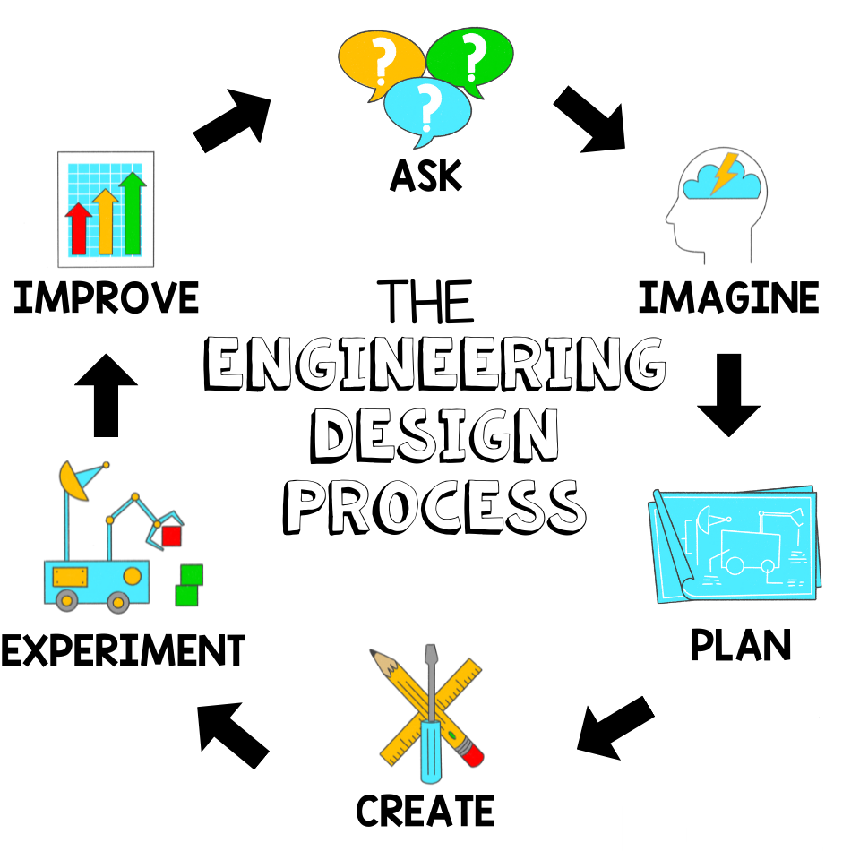
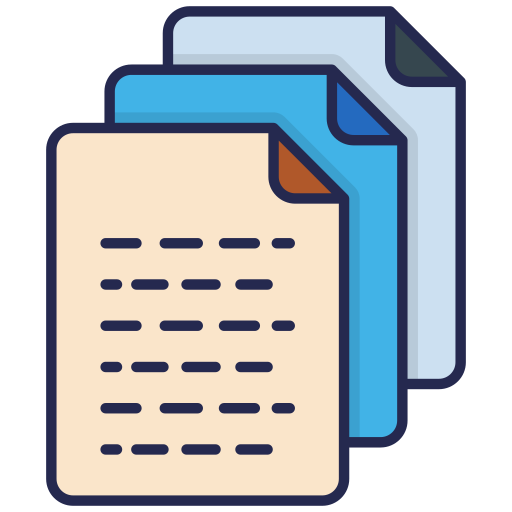
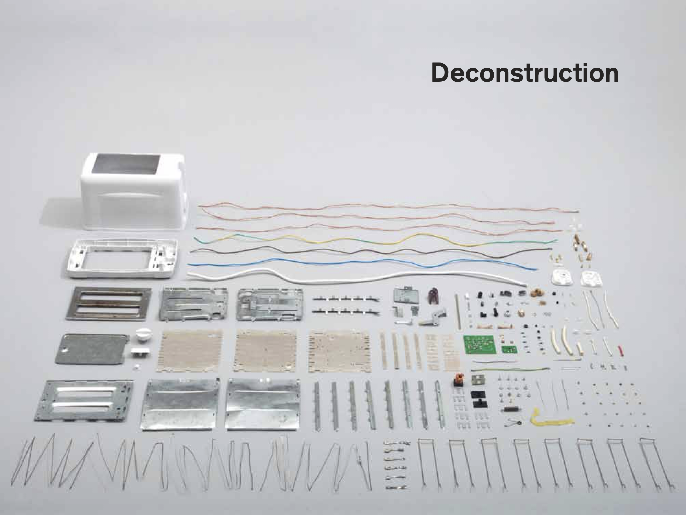
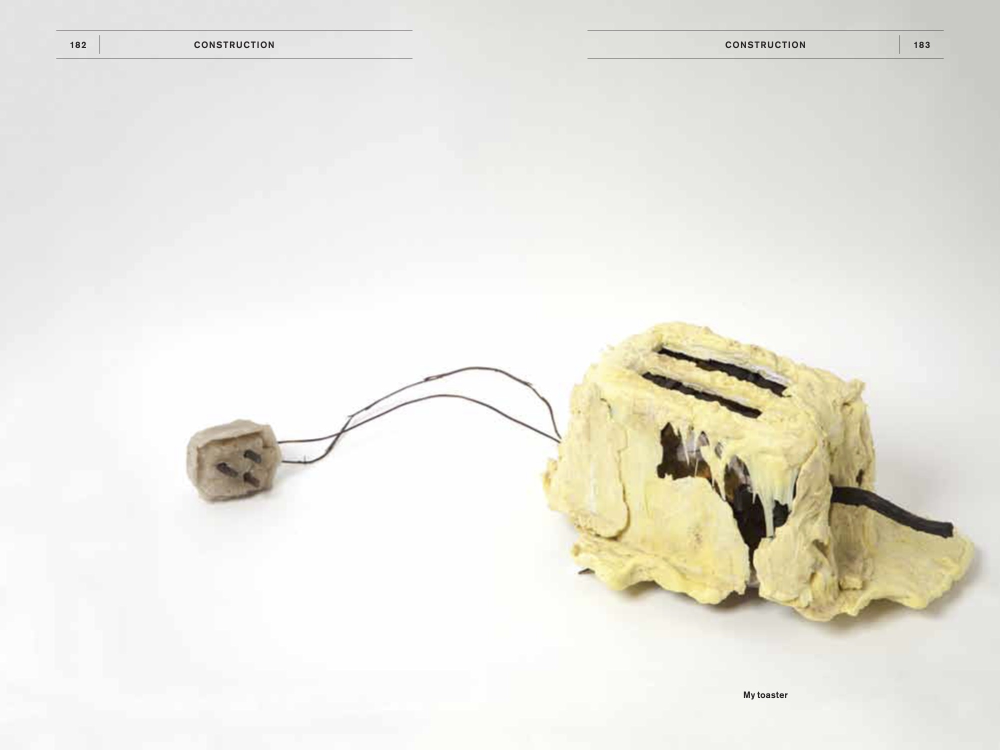
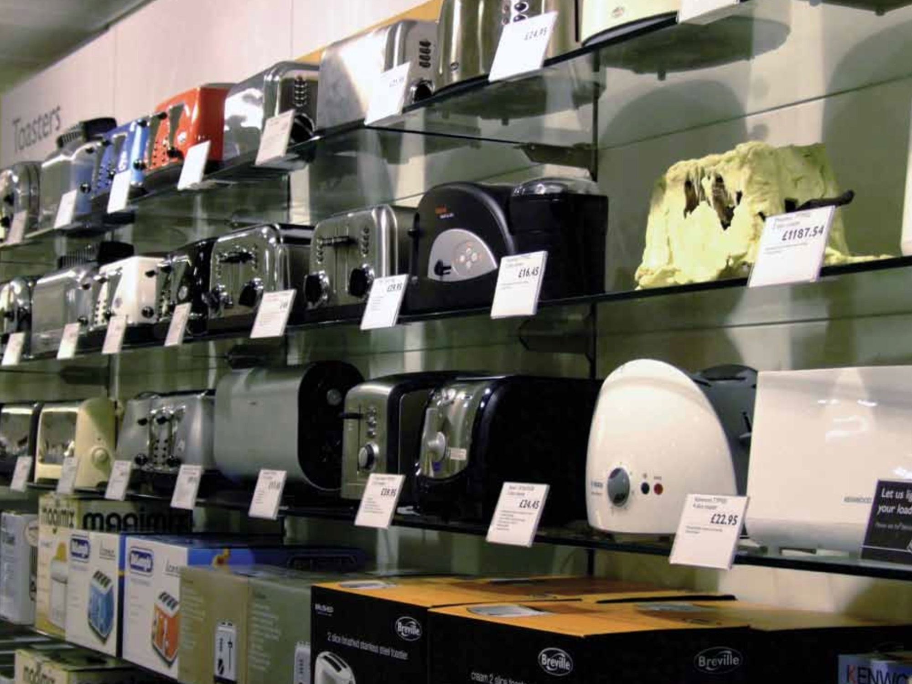

```{r setup, include=FALSE}
knitr::opts_chunk$set(warning = FALSE, message = FALSE, 
                      fig.retina = 3, fig.align = "center")
```

class: center middle main-title section-title-4

# Integrate<br>Engineering<br>Design

.class-info[
<span style="font-size: 64pt;">👨‍🎨 👩‍🎨</span>

DAEN 640 Capstone Senior Design

.light[
Alexander Abuabara<br>
Jan 2026]
]

---

class: title title-inv-1

# Plan for today

.box-2.medium.sp-after-veryshort[Engineering Design Process]
.box-4.medium.sp-after-veryshort[Integrated Engineering Design Process]
.box-5.medium.sp-after-veryshort[System Architecture, Data Pipeline]
.box-6.medium.sp-after-veryshort[*The Toaster Project*]
.box-7.medium.sp-after-veryshort[Challenges, Solutions]

---

class: title title-1

# Learning Goals

.box-inv-1.medium.sp-after-veryshort[Map the V-Model]
.box-inv-1.medium.sp-after-veryshort[Identify Configuration Items]
.box-inv-1.medium.sp-after-veryshort[Understand Traceability]
.box-inv-1.medium.sp-after-veryshort[Connect Tests to Artifacts]
.box-inv-1.medium.sp-after-veryshort[Evaluate Change Impact]

---

.center[*Descriptions*]

.pequeno[
* **<span style="color: black;">Map the V-Model</span>**<br><span style="color: gray;">See how requirements, design, and implementation connect to testing and validation.</span>
* **<span style="color: black;">Identify Configuration Items</span>**<br><span style="color: gray;">Recognize key items (requirements, schemas, code, pipelines, infrastructure) and how they are versioned.</span>
* **<span style="color: black;">Understand Traceability</span>**<br><span style="color: gray;">Follow how requirements link to system components, data pipelines, and tests.</span>
* **<span style="color: black;">Connect Tests to Artifacts</span>**<br><span style="color: gray;">Identify what is tested or validated for each major configuration item.</span>
* **<span style="color: black;">Evaluate Change Impact</span>**<br><span style="color: gray;">Understand how changes ripple across design, implementation, and testing.</span>
]

---

layout: false
class: center middle section-title section-title-2 animated fadeIn

# Engineering Design Process

---

layout: false

.center[
<figure class="figure">

</figure>
]
.small[A step-by-step approach engineers use to identify problems, brainstorm solutions, build and test prototypes, and improve designs to create effective, practical solutions.]

---

layout: false

.center[
<figure class="figure">

</figure>
]
.center[https://www.youtube.com/watch?v=qqs3fxfmWr4]

---

.box-3.large[<span style="color: yellow;">Life Lessons from a Pencil</span>]

.box-inv-3.sp-after-veryshort[*What matters is what’s inside*]
.box-inv-3.sp-after-veryshort[*Keep yourself sharp*]
.box-inv-3.sp-after-veryshort[*Mistakes are part of the process*]
.box-inv-3.sp-after-veryshort[*Pressure creates output*]
.box-inv-3.sp-after-veryshort[*Collaboration matters*]
.box-inv-3.sp-after-veryshort[*Durability comes from design*]

<!-- * What matters is what’s inside: Just as the graphite core defines a pencil’s function, your knowledge, skills, and values define your potential. Focus on strengthening your "core." -->
<!-- * Keep yourself sharp: Pencils must be sharpened to perform well; similarly, continuous learning, practice, and self-improvement keep you ready to tackle challenges. -->
<!-- * Mistakes are part of the process: Pencils leave marks that can be erased. Mistakes are natural in learning and life; they are opportunities to correct, adapt, and grow. -->
<!-- * Pressure creates output: Just as the pencil requires controlled pressure to write, challenges in life and studies can produce meaningful results if approached with care and persistence. -->
<!-- * Collaboration matters: A pencil is made of multiple components—wood, graphite, clay, paint—working together to create a functional product. Success often comes from teamwork and combining diverse strengths. -->
<!-- * Durability comes from design: Thoughtful planning and preparation in pencils prevent breakage. Similarly, careful goal-setting and consistent effort build resilience and long-term success. -->

---

&nbsp;

&nbsp;

.box-2.medium.sp-after-short[Imagine a pencil journey as a metaphor]

.box-inv-2.normal.sp-after-veryshort[Raw Materials → Shaping → Testing → Final Pencil]

---

.box-2.large[Engineering Design Process]

1. Define the problem (*Why make a pencil?*)
2. Research & brainstorm (*What materials & designs?*)
3. Develop concepts (*Sketch ideas, pick the best*)
4. Build & prototype (*Make a sample pencil*)
5. Test & evaluate (*Does it write? Break?*)
6. Redesign/refine (*Improve core, casing, process*)

---

.box-2.large[Engineering Design Process]

.pull-left-3.center[
.box-inv-2[Material Selection and Functionality]]

.pull-middle-3[
.box-inv-2[Mapping Process to Design Stages]]

.pull-right-3[
.box-inv-2[Balancing Constraints]]

---

.box-2.large[Engineering Design Process]

.pull-left-3[
.box-inv-2[Material Selection and Functionality]
.pequeno[
<u>Multiple cycles of design thinking</u>.
Define the problem, explore materials and methods, prototype, test, and refine.
]]

.pull-middle-3[
.box-inv-2[Mapping Process to Design Stages]
.pequeno[
Engineering design is <u>not linear</u>.
Feedback from testing and production continually informs improvements.
]]

.pull-right-3[
.box-inv-2[Balancing Constraints]
.pequeno[
Deliberate choice that balances functional requirements, "manufacturability", cost, and sustainability.
How engineers translate <u>design goals</u> into real-world material and process <u>decisions</u>.
]]

---

layout: false

class: bg-full

background-image: url("images/Engineering_Design_Process2.jpg")

---

layout: false
class: center middle section-title section-title-4 animated fadeIn

# Integrated<br>Engineering Design Process

---

layout: false

&nbsp;

&nbsp;

.box-4.medium.sp-after-veryshort[Integrated Engineering Design Process]

.box-inv-4.small.sp-after-short[<span style="color: red;">(multiple disciplines and feedback loops)</span>]

.box-inv-4.normal.sp-after-veryshort[Materials + Mechanical + Environmental + Economics]

.center[📝💡🔧🔬♻️💰]

---

layout: false

.box-inv-4.normal.sp-after-short[Integrating engineering design means:<br>Combining different subjects, ideas, and people with the Engineering Design Process to solve problems together]

.box-inv-4.small.sp-after-short[<span style="color: purple;">Instead of working in separate steps, this approach encourages teamwork and big-picture thinking to create complete solutions</span>]

--

.box-inv-4.normal.sp-after-short[It helps us build skills in STEM, critical thinking, and practical problem-solving, from the first idea all the way through testing and improving designs]

.box-inv-4.small.sp-after-short[<span style="color: purple;">You see this approach in schools and in big projects</span><br><span style="color: red;">(like designing buildings :)</span>]

---

layout: false
class: center middle section-title section-title-5 animated fadeIn

# System Architecture,<br> Data Pipeline

---

.box-5.large.sp-after-short[System Architecture<br><span style="color: yellow;">(V-Model Aligned)</span>]

.box-inv-5.normal.sp-after-short[**Objective:** Provide a modular, testable architecture that supports traceability from requirements through validation]

.box-inv-5.normal.sp-after-short[High-Level Architecture]

.small[
* Presentation Layer: Dashboards, APIs, reporting interfaces
* Application / Processing Layer: Business logic, analytics services, orchestration
* Data Layer: Raw, curated, and analytics-ready data stores
* Infrastructure Layer: Compute, storage, networking, security controls]

---

.box-5.large.sp-after-short[V-Model Mapping]

.box-inv-5.sp-after-veryshort[Decomposition & Design *(Left Side)*]
.center[
System Requirements → System Architecture<br>
Subsystem Design → Component Design]

.box-inv-5.sp-after-veryshort[Integration & Verification *(Right Side)*]
.center[
Component Testing → Subsystem Integration<br>
System Verification → User Acceptance Validation]

---

.box-5.large.sp-after-short[Configuration Items]

.box-inv-5.normal.sp-after-short[Architecture design documents]

.box-inv-5.normal.sp-after-short[Interface control documents]

.box-inv-5.normal.sp-after-short[Infrastructure-as-Code templates]

.box-inv-5.normal.sp-after-short[Versioned service definitions and APIs]

---

.box-5.large.sp-after-short[End-to-End Data Pipeline]

.pull-left[
.box-inv-5.sp-after-veryshort[Data Ingestion]
.small[
* Batch and streaming sources
* Schema validation and data quality checks]

.box-inv-5.sp-after-veryshort[Data Processing]
.small[
* Transformation, aggregation
* Business rule enforcement]
]

.pull-right[
.box-inv-5.sp-after-veryshort[Data Storage]
.small[
* Raw (immutable), curated, and analytics layers]

.box-inv-5.sp-after-veryshort[Data Consumption]
.small[
* BI tools, ML models, downstream services]
]

---

.box-5.large.sp-after-short[V-Model Alignment]

.center[
Requirements → Data definitions, quality rules

Design → Pipeline workflows, storage schemas

Implementation → ETL/ELT jobs, orchestration logic

Verification & Validation:<br>
.small[Data quality tests, Pipeline integration tests, End-user data validation]
]

---

.box-5.large.sp-after-veryshort[Key Configuration Items]

.center[
Data schemas and metadata definitions<br>
Pipeline code (ETL/ELT, orchestration)<br>
Data quality rules and test cases<br>
Versioned datasets and lineage artifacts]

.box-5.large.sp-after-veryshort[Outcome]

.center[
Full traceability from data requirements to validated outputs<br>
Controlled change management and audit readiness]

---

layout: true
class: title title-5

---

# Project Alignment Questions

.small[
1. *V-Model Mapping:* <span style="color: red;">How does your project diagram map requirements → design → implementation (left side) to testing → integration → validation (right side)?</span>

1. *Configuration Items:* <span style="color: red;">What are the key configuration items (e.g., requirements, schemas, code, pipelines, infrastructure), and how are they identified and versioned?</span>

1. *Traceability:* <span style="color: red;">How does the diagram show traceability between requirements, system components, data pipelines, and verification activities?</span>

1. *Verification & Validation:* <span style="color: red;">For each major CI, what test or validation activity is defined and where is it represented on the right side of the V-Model?</span>

1. *Change Impact:* <span style="color: red;">How does the diagram communicate the impact of changes to requirements or data definitions across design, implementation, and testing?</span>
]

---

# Mini Project Packet

&nbsp;

.box-inv-5.normal.sp-after[
Please be sure to include these answers in your submission
]

.center[
On Canvas - Due 2/16 at 5 PM
]

.center[
<span style="font-size: 32px;">https://canvas.tamu.edu/courses/431435/assignments/2873361</span>
]

.center[
<figure>

</figure>
]

---

layout: false
class: center middle section-title section-title-6 animated fadeIn

# *The Toaster Project*

---

class: bg-full

background-image: url("images/toaster-project.jpg")

&nbsp;

&nbsp;

&nbsp;

&nbsp;

&nbsp;

&nbsp;

&nbsp;

.center[<span style="font-size: 32px;">https://www.thomasthwaites.com/the-toaster-project/</span>]

---

layout: false

.center[
<figure class="figure">

</figure>
]


---

layout: false

.center[
<figure class="figure">

</figure>
]

---

layout: false

.center[
<figure class="figure">

</figure>
]

---

layout: false
class: center middle section-title section-title-7 animated fadeIn

# Challenges, Solutions

---

### Q1. Feasibility & Hidden Complexity  
What assumptions are we making about the simplicity, availability of resources, and manufacturability of our design, and how will we validate or challenge them early?

*<span style="color: gray;">Expose hidden complexity and prevent unrealistic scope definition.</span>*

---

### Q2. Materials, Supply Chains, and Constraints  
What critical materials, tools, and external resources does our project depend on, and what are the risks if they are unavailable or delayed?

*<span style="color: gray;">Early supply-chain awareness and contingency planning.</span>*

---

### Q3. Cost and Schedule Realism  
How will we estimate cost and schedule realistically, and where do we expect uncertainty, rework, or iteration to occur?

*<span style="color: gray;">Encourage defensible planning with buffers and explicit risk acknowledgment.</span>*

---

### Q4. Performance Definition & Validation  
What does “success” mean for our system, and how will we verify and validate performance throughout the project rather than only at the end?

*<span style="color: gray;">Link requirements to measurable, testable outcomes.</span>*

---

### Q5. Process Choices & Tradeoffs  
How will we evaluate alternative technical approaches, and what criteria will justify simplifying, changing, or abandoning a design when constraints arise?

*<span style="color: gray;">Promote pragmatic, evidence-based engineering decisions.</span>*

---

### Q6. Documentation & Learning from Failure  
How will we document decisions, failures, and lessons learned in real time, and how will this knowledge be used to improve subsequent design choices?

*<span style="color: gray;">Reinforce engineering as an iterative, learning-driven process.</span>*
